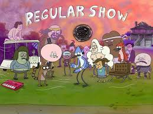
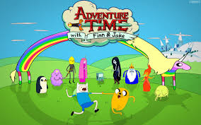

# index.html
Index is the main aspect of this code, it links everything together and is the main part of the HTML
```html
<link rel="stylesheet" href="style.css" />
    <script src="script.js" defer></script>
  </head>
  <body>
    <nav class="navbar navbar-expand-lg bg-body-tertiary">
      <div class="container-fluid">
        <a class="navbar-brand" href="#">📺 Shows</a>
        <button
          class="navbar-toggler"
          type="button"
          data-bs-toggle="collapse"
          data-bs-target="#navbarNavDropdown"
          aria-controls="navbarNavDropdown"
          aria-expanded="false"
          aria-label="Toggle navigation"
        >
          <span class="navbar-toggler-icon"></span>
        </button>
        <div class="collapse navbar-collapse" id="navbarNavDropdown">
          <ul class="navbar-nav">
            <li class="nav-item">
              <a class="nav-link active" aria-current="page" href="#"></a>
            </li>
            <li class="nav-item">
              
            </li>
            <li class="nav-item">
              <a class="nav-link" href="#"></a>
            </li>
            <li class="nav-item dropdown">
              <a
                class="nav-link dropdown-toggle"
                href="#"
                role="button"
                data-bs-toggle="dropdown"
                aria-expanded="false"
              >
                Shows:
              </a>
              <ul class="dropdown-menu">
                <li><a class="dropdown-item" href="anime.html">Animes</a></li>
                <li><a class="dropdown-item" href="tv.html">TV Shows</a></li>
                <li> <a class="dropdown-item" href="cartoon.html">Cartoons</a></li>
              </ul>
            </li>
          </ul>
        </div>
      </div>
    </nav>

    <div class="search-container mt-4">
      <form class="d-flex justify-content-center" action="/action_page.php">
        <input type="text" placeholder="Search.." name="search" />
        <button type="submit">🔍</button>
      </form>
    </div>

    <div class="hero-image">
      <div class="box">
        
        <button id="regBtn">Learn</button>
      </div>
      <div class="box">
        
        <button id="advBtn">Learn</button>
      </div>
      <!-- <div class="box3">
        
      </div> -->
    </div>
    <div class="hero-image1">
      <div class="box">
        
        <button id="opBtn">Learn</button>
      </div>
      <div class="box">
        
        <button id="bleachBtn">Learn</button>
      </div>
      <!-- <div class="box3">
        
      </div> -->
    </div>
    <div class="hero-image2">
      <div class="box">
        
        <button id="dexBtn">Learn</button>
      </div>
      <div class="box">
        
        <button id="cmBtn">Learn</button>
      </div>
      <!-- <div class="box3">
        
      </div> -->
    </div>
    <script src="greet.js"></script>
    <!-- <script src="render.js"></script> -->
    <script src="timer.js"></script>
  </body>
</html>
```

# Script.js
This is the script to the front page, it uses the 6 data arrays to showcase as the front page 

## Usage
```js 


let regular = {
  dateAired: "September 6, 2010",
  mainCharacters: ["Mordecai", "Rigby", "Benson", "Skips", "Pops", "Ghost"],
  premise: "Regular Show centers on two best friends, Mordecai, a blue jay, and Rigby, a raccoon, who are groundskeepers at a park. Their mundane jobs are constantly threatened by their boss, Benson, but they frequently get into bizarre and humorous adventures that often have a surreal, almost magical, quality. The show's premise revolves around their attempts to liven up their everyday lives, sometimes with disastrous consequences.",
  genre: "Action-Adventure",
  rating: "PG-13"
}          
const regBtn = document.getElementById("regBtn");

regBtn.addEventListener("click", function () {
    window.location = "./cartoon.html"

});


// rewrite arrays -> objects

const advBtn = document.getElementById("advBtn");

advBtn.addEventListener("click", function () {
    window.location = "./cartoon.html"

});

const opBtn = document.getElementById("opBtn");

opBtn.addEventListener("click", function () {
    window.location = "./anime.html"

});

const bleachBtn = document.getElementById("bleachBtn");

bleachBtn.addEventListener("click", function () {
    window.location = "./anime.html"

});

const dexBtn = document.getElementById("dexBtn");

dexBtn.addEventListener("click", function () {
    window.location = "./tv.html"

});

const cmBtn = document.getElementById("cmBtn");

cmBtn.addEventListener("click", function () {
    window.location = "./tv.html"

});
```

## All javascripts

All the javascripts run a similar code, this is so they can function the same in each site, and so you're able to find what you're looking for

```js 
function showAnime(show) {
  document.getElementById("box").innerHTML = `
    <h1>${show.name}</h1>
  
    <p>${show.dateAired}</p>
    <p>${show.mainCharacters}</p>
    <p>${show.premise}</p>
    <p>${show.genre}</p>
    <p>${show.rating}</p>

    `;
}
showAnime(animes[0]);


function renderShows(shows) {
  console.log("renderShows called with", shows.length, "shows");

  const resultsContainer = document.getElementById("resultsContainer");

  if (!resultsContainer) {
    console.error("Results container not found");
    return;
  }

  resultsContainer.innerHTML = "";

  if (shows.length === 0) {
    console.log("No shows found, showing empty message");
    resultsContainer.innerHTML = '<p id = "noResults"> No shows found </p>';
    return;
  }

  const showElements = [];

  shows.forEach((show) => {
    if (!show || typeof show.name !== "string") {
      console.warn("Invalid show object:", show);
      return;
    }

    const showDiv = document.createElement("div");
    showDiv.className = "show-card";
    showDiv.innerHTML = `
        <div class="show-header">
        
                <h3>${show.name}</h3>
                </div>
                <p> <strong> Rating: </strong> ${show.rating || "Unknown"}</p>
                <p> <strong> Genre: </strong> ${show.genre || "Unknown"}</p>
                <a href="#box">
                <button class="learn-more-btn">Learn More</button>
                </a>

    `;
    showElements.push(showDiv);
  });

  showElements.forEach((elements) => {
    resultsContainer.appendChild(elements);
  });
  addEvents()
  console.log(`Successfully rendered ${shows.length} shows `);
} // end of renderShows
function addEvents() {
  document.querySelectorAll(".learn-more-btn").forEach((btn, index) => {
    btn.addEventListener("click", () => showAnime(animes[index]));
  });
}

// search shows
function initializeSearch() {
  console.log("Initializing search functionality");
  renderShows(animes);
  const searchInput = document.getElementById("searchInput");
  if (!searchInput) {
    console.error("Search input element not found");
    return;
  }

  searchInput.addEventListener("input", function () {
    const searchTerm = this.value.trim().toLowerCase();
    console.log("Input event detected, search term:", searchTerm);

    if (searchTerm !== "") {
      searchShows(searchTerm);
    } else {
      renderShows(animes);
    }
  });

  searchInput.addEventListener("keydown", function (e) {
    if (e.key === "Enter") {
      const searchTerm = searchInput.value.trim().toLowerCase();
      console.log("Enter key pressed for search term:", searchTerm);

      if (searchTerm !== "") {
        searchShows(searchTerm);
        saveSearchTerm(searchTerm);

        searchInput.value = "";
      }
    }
  });
} // end of initializeSearch
initializeSearch();

function searchShows(searchTerm) {
  console.log("searchShows called with term:", searchTerm);

  if (typeof animes === "undefined" || !Array.isArray(animes)) {
    console.error("showData is not definied or not an array in searchShows");
    return;
  }

  if (searchTerm === "") {
    console.log("Empty search term, showing all shows");
    renderShows(animes);
    return;
  }

  let filtered = animes.filter((s) => {
    return s.name.toLowerCase().includes(searchTerm)
  })

  renderShows(filtered)
}

function saveSearchTerm() {}
```

I used render as a function to be able to render the search, and I have the saveSearchTerm function to save the search into the cookie, and an initialize search function to initialize the search fully.


## CSS
For the CSS they all followed the same code for optimal background and good visibility for users.
```css 
* {
    box-sizing: border-box;
  }

.hero{
    background-image: url('cartoonbg.png');
    background-size: cover;
    width: 100%;
    height: 90vh;
    display: flex;
    align-items: center;
    justify-content: center;
    background-color: rgba(0, 0, 0, .60);
    background-blend-mode: darken;
}
- this is the 'background', in each css they have a different 'image' in the background.

.container {
  display: flex;
  align-items: center;
}

#box {
  padding: 1rem;
  width: 800px;
  height: 500px;
  margin: 0 1rem;
  display: flex;
  flex-direction: column;
  justify-content: center;
  align-items: center;
  text-align: center;
  color: black;
  background-color: white;
}
- The box in the middle of the screen upon selecting a show.

#resultsContainer{
background: black;
display: flex;
flex-wrap: wrap;
gap: 1rem;
justify-content: space-evenly;
padding: 2rem 0;
}

.show-card{
width: 300px;
padding: 1rem;
background-color: white;
text-align: center;
}
```

## Greet js
For the greet function I followed specific and minute details of the code.
```js
function greetUser(){
    const hasVisitedBefore = document.cookie.includes('visitedBefore=true');
    if(hasVisitedBefore){
        alert("Welcome back to Shows and animes to watch");
    } else {
        const expiryDate = new Date();
        expiryDate.setDate(expiryDate.getDate() + 7);
        document.cookie = `visitedBefore=true; expires=${expiryDate.toUTCString()}; path=/`;
        alert("Welcome to shows and animes to watch");
    }
}
greetUser()
``` 
An alert was made that welcomes user into the webiste, or welcomes them back if they already visited it, the expirydate being 7 days. At the end it would return and greet the user.


## Timer
A timer was made to track how much time the user spends on each site.

```js
function startTimer(){
    console.log('Starting session timer');

    if (document.getElementById('sessionTimer')){
        console.log('Timer already exist, not creating a new one');
        return;
    }

    let sessionSeconds = 0;

    const timerElement = document.createElement('div');
    timerElement.id = "sessionTimer";
    timerElement.style.marginTop = "20px";
    timerElement.style.color = "var(--primary-color)";
    timerElement.style.fontSize = "18px";
    timerElement.style.textAlign = "center";
    document.body.appendChild(timerElement);

    updateTimerDisplay(timerElement, sessionSeconds);

    let timerInterval = setInterval(()=>{
        sessionSeconds++;
        updateTimerDisplay(timerElement, sessionSeconds);

        sessionStorage.setItem('timeOnPage', sessionSeconds.toString());

        if(sessionSeconds === 300) {
            showLongSessionMessage();
        
        }
    }, 1000);

    window.addEventListener('beforeunload', () =>{
        console.log('Page unloading, stopping timer');
        clearInterval(timerInterval);
    });
}

function updateTimerDisplay(element, totalSeconds){
    const hours = Math.floor(totalSeconds / 3600);
    const minutes = Math.floor((totalSeconds % 3600) / 60);
    const seconds = totalSeconds % 60;

    let timeText = `⏱Time on Page: `;

    if(hours > 0){
        timeText += `${hours}h`;
    }
    if(hours > 0 || minutes > 0){
        timeText += `${minutes}m `;
    }

    timeText += `${seconds}s`;

    element.textContent = timeText;
}

function showLongSessionMessage(){
    console.log('Showing long session message (5 minutes)');

    if(document.getElementById('longSessionMessage')){
        console.log('Long session message already exist');
        return;
    }

    const messageDiv = document.createElement('div');
    messageDiv.id = "longSessionMessage";
    messageDiv.style.padding = '10px';
    messageDiv.style.margin = '20px 0';
    messageDiv.style.backgroundColor = 'var(--primary-color)';
    messageDiv.style.color = 'var(--btn-text)';
    messageDiv.style.borderRadius = '8px';
    messageDiv.style.textAlign = 'center';
    messageDiv.innerHTML = `<p>📺 You've been looking for 5 minutes, thanks for your interest in Shows and Animes to watch!</p>
    <button id="dismissMessage" style="margin-top: 10px; padding: 5px 10px; border: none; border-radius: 4px; cursor: pointer;">
    Dismiss
    </button>
    `;


    const timerElement = document.getElementById('sessionTimer');
    if(timerElement){
        document.body.insertBefore(messageDiv, timerElement);
    } else {
        document.body.appendChild(messageDiv);
    }

    const dismissButton = document.getElementById('dismissMessage');
    if(dismissButton) {
        dismissButton.addEventListener('click', function(){
            const message = document.getElementById('longSessionMessage');
            if(message){
                message.remove();
            }
        });
    }
}


startTimer();
```
The first thing that was done was to make the timer appear, and if there was already one, it would not reappear.  The timer then got css elements implemented into it, leaving it at the bottom middle of the screen. Next we did a method to calculate the seconds, minutes, and hours for the timer. Then at 5 minutes, there will be a thank you message.